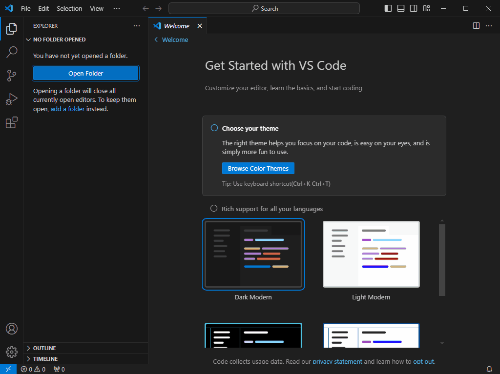
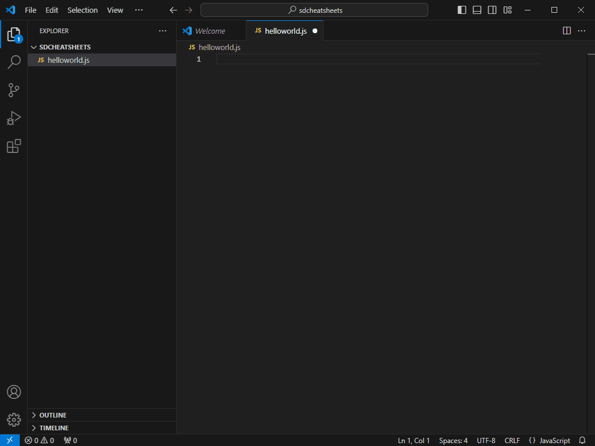

<div class="sdcs-header" markdown>
  
</div>

# Basis Programmeren Tutorial

## Basis ingrediënten
De basis van elke programmeertaal bestaat uit maar een paar dingen. En omdat programmeren in het Engels gaat, gebruiken we meteen maar de Engelse termen:

* Variables, Expressions en Operators
* Control Flow
* Functions
* Data Structures
* Input en Output

Deze elementen komen in elke taal terug!

De enige manier om te leren programmeren is door programma's te schrijven. Maar welke taal moet je kiezen om mee te starten? In deze Tutorial wordt voornamelijk JavaScript gebruikt en hier en daar krijg je ook alvast een inkijkje in hoe het in andere talen werk.

## Ontwikkelomgeving opzetten
Om ons eerste programma in JavaScript te maken installeren we twee nieuwe programma's:

* Node.js
* Visual Studio Code

Met Visual Studio Code kan je JavaScript code schrijven en Node.js kan JavaScript code uitvoeren.

Download de **Node.js Prebuilt Installer** hier: <a href="https://nodejs.org/en/download/prebuilt-installer">https://nodejs.org/en/download/prebuilt-installer</a>

Download **Visual Studio Code** hier: <a href="https://code.visualstudio.com/download">https://code.visualstudio.com/download</a>

Installeer Node.js en Visual Studio Code

Open Visual Studio Code en maak een folder aan met de naam "sdcheatsheets". Maak in de nieuwe folder een nieuw bestand aan met de naam helloworld.js.



Het is een goed gebruik om je eerste programma in een nieuwe taal "hello world" te noemen.

Nu gaan we de code schrijven voor ons helloworld.js programma. Dat is nu nog maar 1 regel:

```
console.log("Hello, World!");
```
Open een nieuwe Terminal en voer het programma uit:
```Shell
node .\helloworld.js # (1)!
```

1.  :man_raising_hand: **Je hoef niet alles zelf te typen!** Begin met **"node hel"** te typen, en druk dan op de Tab toets om de Terminal de rest automatisch af te laten maken.



Nu je het hello world JavaScript programma werkend hebt, kunnen we aan de slag met het verkennen van de basisingrediënten van programmeren.

**Schrijf de code stap voor stap mee. Elke keer als je deze emoji ziet: :man_technologist:, pas je de code aan en test je de code op de terminal.**

## Variabelen
Een variabele is een stukje geheugen van de computer waar we een waarde in kunnen opslaan. 

Een variabele heeft een **naam** en een **waarde**.

In elke taal kan een variabele er anders uitzien, maar het principe blijft hetzelfde. Hier wat voorbeelden van een variabele in verschillende programmeertalen:

=== "JavaScript"
    ```
    let greeting = "Hello, World!";
    ```
=== "PHP"
    ```
    $greeting = "Hello, World!";
    ```
=== "Python"
    ```
    greeting = "Hello, World!";
    ```
=== "C"
    ```
    char greeting[] = "Hello, World!";
    ```
=== "C++"
    ```
    string greeting = "Hello, World!";
    ```
=== "C#"
    ```
    string greeting = "Hello, World!";

    // Je kan dit ook zo doen (maar alleen met locale variabelen in methods):

    var greeting = "Hello, World!";
    ```

## Syntax
Je ziet wel, verschillende talen, verschillende manieren. Dit noemen we de **syntax** van een taal. Elke taal heeft een andere syntax, een andere manier van schrijven.

Maar in alle voorbeelden is het resultaat hetzelfde: de variabele "greeting" krijgt de waarde "Hello, World!".

:man_technologist:{ .big-emoji }

Nu gaan we deze nieuwe kennis toepassen in ons JavaScript programma, verander de code en run daarna de code om te testen dat het programma nog steeds hetzelfde werkt:

```JavaScript
let greeting = "Hello, World!";
console.log(greeting);
```

## if-else
Een if-else block is een onderdeel van Control Flow in je programma. Met Control Flow wordt bedoeld in welke volgorde je code wordt uitgevoerd. Normaal gesproken loopt een computerprogramma van de eerste regel tot de laatste regel, maar dit kan je op een aantal manieren beïnvloeden. Bijvoorbeeld met een **if-else** block.

:man_technologist:{ .big-emoji }

We passen het programma aan zodat we te weten komen welk moment van de dag het is, ochtend, middag of avond. Daarna laten we een nieuwe melding zien met 'Good Morning', 'Good Afternoon' of 'Good Evening'.

``` javascript linenums="1"
let greeting = "Hello, World!";
console.log(greeting);

const now = new Date();
const hour = now.getHours();

if (hour < 12) {
    console.log("Good Morning");
} else if (hour < 18) {
    console.log("Good Afternoon");
} else {
    console.log("Good Evening");
}
```


* op regel 3 en 4 wordt in twee stappen het huidige uur van de dag opgehaald
* op regel 6 staat: **als hour kleiner is dan 12**. Als dit waar (true) is dan wordt de code tussen de twee krulhaken {} eronder uitgevoerd, als het niet waar (false) is dan gaat de code verder op regel 8
* op regel 8 staat: **als hour kleiner is dan 18**. Als dit waar is dan wordt de code eronder uitgevoerd, als het niet waar is dan gaat de code verder met regel 10
* regel 10 zegt: als al het bovenstaande niet waar is, voer dan de code hieronder uit

!!! note "const"

    Het keyword **const** is een manier om een zogenaamde **constante** te maken. Een constante is een variabele waarvan de waarde nooit meer zal veranderen. Het is netjes om const te gebruiken als je weet dat de variabele niet zal veranderen.

## Operators
Je ziet in de code hierboven alvast één **Operator**, het **kleiner dan teken** `<`. Er zijn nog meer operators. Je gebruikt operators in **Expressions**. `(hour < 12)` noemen we een expression.

Hier is een lijst van veelgebruikte operators (JavaScript):

| Operator       | Beschrijving                            |
|----------------|-----------------------------------------|
| `+`            | Optelling                               |
| `-`            | Aftrekking                              |
| `*`            | Vermenigvuldiging                       |
| `/`            | Deling                                  |
| `%`            | Modulus (restwaarde van een deling)     |
| `++`           | Increment (verhoog met één)             |
| `--`           | Decrement (verlaag één)                 |
| `=`            | Toewijzing                              |
| `==`           | Gelijkheid (vergelijken van waarden)    |
| `!=`           | Ongelijkheid (vergelijking van waarden) |
| `>`            | Groter dan                              |
| `<`            | Kleiner dan                             |
| `>=`           | Groter dan of gelijk aan                |
| `<=`           | Kleiner dan of gelijk aan               |
| `&&`           | Logische EN                             |
| `||`           | Logische OF                             |
| `!`            | Logische NIET                           |

## Expressions
Een expression is een combinatie van variabelen en/of constanten en/of functies en operators. Een expression levert een bepaalde waarde op. Dat kan een getal zijn of true of false of juist helemaal niks (null).

Hier zijn wat voorbeelden van eenvoudige expressions:

|Expression|Beschrijving|Uitkomst|
|---|---|---|
10 < 20|10 is kleiner dan 20|true|
10 > 20|10 is groter dan 20|false|
10 == 20|10 is gelijk aan 20|false|
10 + 20|10 plus 20|30|

## Loops
We gaan verdeer met een andere manier om de Control Flow te veranderen, de **loop**. Een loop (lus in het Nederlands), is een manier om code te herhalen. Stel je voor dat je in plaats van maar één keer, wel tien keer "Hello, World!" wilt laten zien. Je kan ervoor kiezen om dan gewoon tien keer `console.log("Hello, World!")` te coderen:

```javascript
console.log("Hello, World!");
console.log("Hello, World!");
console.log("Hello, World!");
console.log("Hello, World!");
console.log("Hello, World!");
console.log("Hello, World!");
console.log("Hello, World!");
console.log("Hello, World!");
console.log("Hello, World!");
console.log("Hello, World!");
```
Dat ziet er niet goed uit! Een loop brengt uitkomst. Je kan een **while loop** of een **for loop** gebruiken:

=== "while loop"
    ```javascript
    let i = 0;
    while (i < 10) {
      console.log("Hello, World!");
      i = i + 1;
    }
    ```
=== "for loop"
    ```javascript
    for (let i = 0; i < 10; i++) {
      console.log("Hello, World!");
    }
    ```

Dat is beter! Het scheelt zelfs vijf regels code. De **for loop** is nog korter, drie regels code.
Of je een for loop of een while loop gebruikt is afhankelijk van de situatie. Je kiest vaak een for loop als je van tevoren weet hoe vaak je wilt loopen. Als je niet weet hoe vaak je wilt herhalen, dan kies je de while loop. Verder doen ze allebei hetzelfde.


:man_technologist:{ .big-emoji }
```
```


