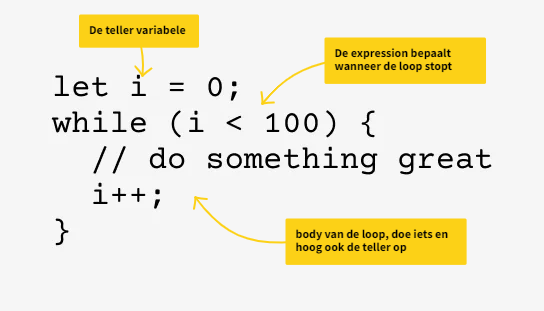
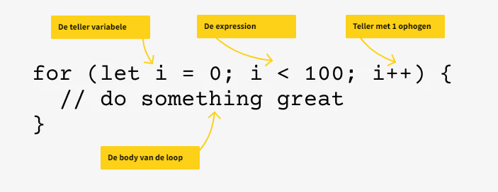
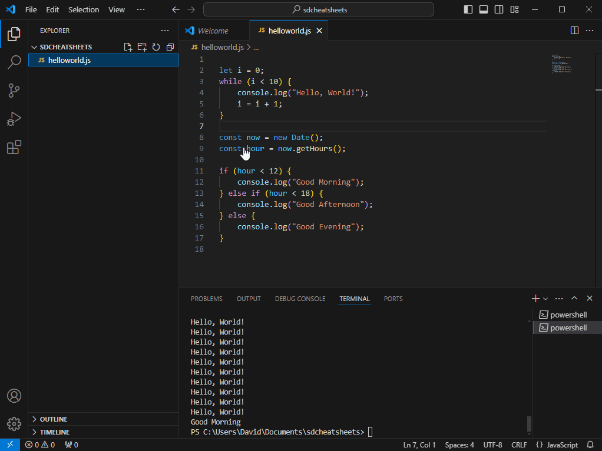

<div class="sdcs-header" markdown>
  
</div>

# Basis Programmeren Tutorial

## Basis ingrediënten
De basis van elke programmeertaal bestaat uit maar een paar dingen. En omdat programmeren in het Engels gaat, gebruiken we meteen maar de Engelse termen:

* Variables, Expressions en Operators
* Control Flow
* Functions
* Data Structures
* Input en Output

Deze elementen komen in elke taal terug!

De enige manier om te leren programmeren is door programma's te schrijven. Maar welke taal moet je kiezen om mee te starten? In deze Tutorial wordt voornamelijk JavaScript gebruikt en hier en daar krijg je ook alvast een inkijkje in hoe het in andere talen werkt.

## Ontwikkelomgeving opzetten
Om ons eerste programma in JavaScript te maken installeren we twee nieuwe programma's:

* Node.js
* Visual Studio Code

Met Visual Studio Code kan je JavaScript code schrijven en Node.js kan JavaScript code uitvoeren.

Download de **Node.js Prebuilt Installer** hier: <a href="https://nodejs.org/en/download/prebuilt-installer">https://nodejs.org/en/download/prebuilt-installer</a>

Download **Visual Studio Code** hier: <a href="https://code.visualstudio.com/download">https://code.visualstudio.com/download</a>

Installeer Node.js en Visual Studio Code

Open Visual Studio Code en maak een folder aan met de naam "sdcheatsheets". Maak in de nieuwe folder een nieuw bestand aan met de naam helloworld.js.


Het is een goed gebruik om je eerste programma in een nieuwe taal "hello world" te noemen.

Nu gaan we de code schrijven voor ons helloworld.js programma. Dat is nu nog maar 1 regel:

```
console.log("Hello, World!");
```
Open een nieuwe Terminal en voer het programma uit:
```Shell
node .\helloworld.js # (1)!
```

1.  :man_raising_hand: **Je hoef niet alles zelf te typen!** Begin met **"node hel"** te typen, en druk dan op de Tab toets om de Terminal de rest automatisch af te laten maken.


Nu je het hello world JavaScript programma werkend hebt, kunnen we aan de slag met het verkennen van de basisingrediënten van programmeren.

**Schrijf de code stap voor stap mee. Elke keer als je deze emoji ziet: :man_technologist:, pas je de code aan en test je de code op de terminal.**

## Variabelen
Een variabele is een stukje geheugen van de computer waar we een waarde in kunnen opslaan. 

Een variabele heeft een **naam** en een **waarde**.

In elke taal kan een variabele er anders uitzien, maar het principe blijft hetzelfde. Hier wat voorbeelden van een variabele in verschillende programmeertalen:

=== "JavaScript"
    ```
    let greeting = "Hello, World!";
    ```
=== "PHP"
    ```
    $greeting = "Hello, World!";
    ```
=== "Python"
    ```
    greeting = "Hello, World!";
    ```
=== "C"
    ```
    char greeting[] = "Hello, World!";
    ```
=== "C++"
    ```
    string greeting = "Hello, World!";
    ```
=== "C#"
    ```
    string greeting = "Hello, World!";

    // Je kan dit ook zo doen (maar alleen met locale variabelen in methods):

    var greeting = "Hello, World!";
    ```

## Syntax
Je ziet wel, verschillende talen, verschillende manieren. Dit noemen we de **syntax** van een taal. Elke taal heeft een andere syntax, een andere manier van schrijven.

Maar in alle voorbeelden is het resultaat hetzelfde: de variabele "greeting" krijgt de waarde "Hello, World!".

:man_technologist:{ .big-emoji }

Nu gaan we deze nieuwe kennis toepassen in ons JavaScript programma, verander de code en run daarna de code om te testen dat het programma nog steeds hetzelfde werkt:

```JavaScript
let greeting = "Hello, World!";
console.log(greeting);
```

## Comments
Voordat we aan de slag gaan met programmeren moet je eerst weten van comments, commentaar in code. In de voorbeeld code verderop in deze tutorial komt dit namelijk regelmatig voor. Een comment is een stukje uitleg bij code die verder niet gebruikt wordt door de computer. Het is bedoeld om uit te leggen wat een stukje code doet.

Je gebruikt comments voor jezelf, om later beter te begrijpen waarom je iets doet, maar ook voor andere programmeurs die met jouw code moeten werken.

In JavaScript begin je een comment met twee forward slashes "//". Alles wat daarna komt is een comment.

Bijvoorbeeld:

```javascript
// The first elf has to be Aragorn
let elf1 = 'Aragorn';
```

of 

```javascript
let elf2 = 'Arwen'; // The second elf must be Arwen
```

Als je meerdere regels met commentaar wilt schrijven dan zet je het commentaar tussen `/*` en `*/`. Bijvoorbeeld zo:

```javascript
/* 
   The first elf must always be Aragorn
   The second elf must always be Arwen
   All the other elven names can be any name
*/
let elf1 = 'Aragorn';
let elf2 = 'Arwen';
let elf3 = 'Arathorn';
```

## if-else
Een if-else block is een onderdeel van Control Flow in je programma. Met Control Flow wordt bedoeld in welke volgorde je code wordt uitgevoerd. Normaal gesproken loopt een computerprogramma van de eerste regel tot de laatste regel, maar dit kan je op een aantal manieren beïnvloeden. Bijvoorbeeld met een **if-else** block.

:man_technologist:{ .big-emoji }

We passen het programma aan zodat we te weten komen welk moment van de dag het is, ochtend, middag of avond. Daarna laten we een nieuwe melding zien met 'Good Morning', 'Good Afternoon' of 'Good Evening'.

``` javascript linenums="1"
let greeting = "Hello, World!";
console.log(greeting);

const now = new Date();
const hour = now.getHours();

if (hour < 12) {
    console.log("Good Morning");
} else if (hour < 18) {
    console.log("Good Afternoon");
} else {
    console.log("Good Evening");
}
```


* op regel 3 en 4 wordt in twee stappen het huidige uur van de dag opgehaald
* op regel 6 staat: **als hour kleiner is dan 12**. Als dit waar (true) is dan wordt de code tussen de twee krulhaken {} eronder uitgevoerd, als het niet waar (false) is dan gaat de code verder op regel 8
* op regel 8 staat: **als hour kleiner is dan 18**. Als dit waar is dan wordt de code eronder uitgevoerd, als het niet waar is dan gaat de code verder met regel 10
* regel 10 zegt: als al het bovenstaande niet waar is, voer dan de code hieronder uit

!!! note "const"

    Het keyword **const** is een manier om een zogenaamde **constante** te maken. Een constante is een variabele waarvan de waarde nooit meer zal veranderen. Het is netjes om const te gebruiken als je weet dat de variabele niet zal veranderen.

## Operators
Je ziet in de code hierboven alvast één **Operator**, het **kleiner dan teken** `<`. Er zijn nog meer operators. Je gebruikt operators in **Expressions**. `(hour < 12)` noemen we een expression.

Hier is een lijst van veelgebruikte operators (JavaScript):

| Operator       | Beschrijving                            |
|----------------|-----------------------------------------|
| `+`            | Optelling                               |
| `-`            | Aftrekking                              |
| `*`            | Vermenigvuldiging                       |
| `/`            | Deling                                  |
| `%`            | Modulus (restwaarde van een deling)     |
| `++`           | Increment (verhoog met één)             |
| `--`           | Decrement (verlaag één)                 |
| `=`            | Toewijzing                              |
| `==`           | Gelijkheid (vergelijken van waarden)    |
| `!=`           | Ongelijkheid (vergelijking van waarden) |
| `>`            | Groter dan                              |
| `<`            | Kleiner dan                             |
| `>=`           | Groter dan of gelijk aan                |
| `<=`           | Kleiner dan of gelijk aan               |
| `&&`           | Logische EN                             |
| `||`           | Logische OF                             |
| `!`            | Logische NIET                           |

## Expressions
Een expression is een combinatie van variabelen en/of constanten en/of functies en operators. Een expression levert een bepaalde waarde op. Dat kan een getal zijn of true of false of juist helemaal niks (null).

Hier zijn wat voorbeelden van eenvoudige expressions:

|Expression|Beschrijving|Uitkomst|
|---|---|---|
10 < 20|10 is kleiner dan 20|true|
10 > 20|10 is groter dan 20|false|
10 == 20|10 is gelijk aan 20|false|
10 + 20|10 plus 20|30|

## Loops
We gaan verdeer met een andere manier om de Control Flow te veranderen, de **loop**. Een loop (lus in het Nederlands), is een manier om code te herhalen. Stel je voor dat je in plaats van maar één keer, wel tien keer "Hello, World!" wilt laten zien. Je kan ervoor kiezen om dan gewoon tien keer `console.log("Hello, World!")` te coderen:

```javascript
console.log("Hello, World!");
console.log("Hello, World!");
console.log("Hello, World!");
console.log("Hello, World!");
console.log("Hello, World!");
console.log("Hello, World!");
console.log("Hello, World!");
console.log("Hello, World!");
console.log("Hello, World!");
console.log("Hello, World!");
```
Dat ziet er niet goed uit! Een loop brengt uitkomst. Je kan een **while loop** of een **for loop** gebruiken:

=== "while loop"
    ```javascript
    let i = 0;
    while (i < 10) {
      console.log("Hello, World!");
      i = i + 1;
    }
    ```
=== "for loop"
    ```javascript
    for (let i = 0; i < 10; i++) {
      console.log("Hello, World!");
    }
    ```

Dat is beter! Het scheelt zelfs vijf regels code. De **for loop** is nog korter, drie regels code.
Of je een for loop of een while loop gebruikt is afhankelijk van de situatie. 

Je kiest vaak een for loop als je van tevoren weet hoe vaak je wilt loopen. En als je nog niet weet hoe vaak je wilt herhalen, dan kies je de while loop. Verder doen ze allebei hetzelfde.

### De onderdelen van een while loop
Allereerst moet je kunnen bijhouden hoe vaak de loop is uitgevoerd. Dit doe je met een variabele. Vaak noemen we deze variabele "i" (de "i" staat voor **i**teration, herhaling).

Je hebt ook een expression nodig om te bepalen wanneer de loop moet stoppen

Tenslotte heb je de body van de loop. In de body wordt het eigenlijke werk van de loop gedaan. In veel talen, en ook in JavaScript, staat de body van de loop tussen twee krulhaken.

In de body kan je ook de teller ophogen, zodat je weet hoe vaak de loop is uitgevoerd.

<p align="center" markdown>
  
</p>

### De onderdelen van een for loop
Een for loop heeft dezelfde onderdelen als een while loop: een **teller**, een **expression** om aan te geven wanneer de loop stopt, een **ophoging** van de teller en natuurlijk een **body**.

Het verschil is dat de teller, de expression en de ophoging nu in 1 regel geschreven zijn, met puntkomma's ertussen:

<p align="center" markdown>
  
</p>

!!! note "Stapgrootte veranderen"

    Je bepaalt zelf hoe vaak de loop loopt. In de bovenste voorbeelden is dat honderd keer. 
    
    De teller begint bij 0 (`let i = 0`) en eindigt bij 99 (want de expression zegt `i < 100`). En de teller wordt elke keer met 1 opgehoogd. 
    
    Maar je kan dit ook veranderen. Je bepaalt zelf waar de teller begint en ook met hoeveel de teller elke keer wordt opgehoogd.

    De onderstaande for loop begint bij 10, loopt door tot en met 100, in stappen van 10:

    ```
    for (let i = 10; i <= 100; i+=10) {
      // do something great
    }
    ```

## Functies
Functies zijn aparte stukjes code die je een naam kan geven en door je hele code heen kan hergebruiken. Met functies maak je je code overzichtelijker. En je voorkomt dat je dezelfde code vaker dan één keer hoeft te schrijven. In plaats van de code elke keer opnieuw te typen, maak je een functie en roep je die functie aan wanneer je hem wilt gebruiken.

Een voorbeeld maakt alles duidelijk. 

We zeggen het Hello World programma gedag en maken een nieuw programma. Zorg dat helloworld.js is opgeslagen en voeg een nieuwe file toe. Dit bestand noem je "chatbot.js".



Om input van de gebruiker te vragen hebben we een library nodig. Een library is een pakket met code die door anderen is geschreven. De library die wij gaan gebruiken heet **prompt-sync**.

Je installeert de libary vanuit de terminal. Type de volgende code in de terminal om de library te installeren:

```
npm -i prompt-sync
```
De library wordt geinstalleerd. Je ziet ook een nieuwe map verschijnen "node-modules". In deze map worden de libraries die je installeert opgeslagen.


Voeg nu de onderstaande code toe.

:man_technologist:{ .big-emoji }
```
const prompt = require('prompt-sync')();

const name = prompt('Hallo, ik ben je chatbot. Hoe heet jij? > ');
console.log("Hi " + name);
```

Run het programma door in de Terminal ```node .\chatbot.js``` te typen.

Het begin is er, maar we willen een echte chatbot, dus moet de chatbot meer vragen gaan stellen en antwoorden geven. We maken hiervoor een loop zodat we na elke vraag en antwoord opnieuw een vraag kunnen stellen.

Voeg de onderstaande code toe:

:man_technologist:{ .big-emoji }
``` javascript
let answer = prompt('Waar wil je het over hebben? > ');
while (answer != 'bye') {
    answer = prompt('Dat is heel interessant! > ');
}

console.log('Het was leuk, tot ziens!');
```
De chatbot blijft in de loop zolang de variabele answer **niet** 'bye' is. Dat is namelijk wat de expression `answer != 'bye'` zegt. De gebruiker kan steeds iets nieuws typen en de chatbot zal blijven zeggen dat het interessant is.

Als de gebruiker 'bye' typt dan wordt de expression in de while false en eindigt de loop. Daarna gaat de code verder met `console.log('Het was leuk, tot ziens!')` en daarna stop het hele programma.

Ons programma ziet er tot nu toe zo uit:

``` py linenums="1"
const prompt = require('prompt-sync')();

const name = prompt('Hallo, ik ben je chatbot. Hoe heet jij? > ');
console.log("Hi " + name);

let answer = prompt('Waar wil je het over hebben? > ');
while (answer != 'bye') {
    answer = prompt('Dat is heel interessant! > ');
}

console.log('Het was leuk, tot ziens!');
```

En dan nu even over die functies, want daar gaat dit hoofdstuk over. We gaan van regel 6 t/m 9 een functie maken.

Voeg onderaan, na regel 11, de volgende code toe:

``` javascript
function talk() {

}
```
Verplaats nu regel 6 t/m 9 naar de body van de function talk (dus tussen de krulhaken). En tenslotte zet je daarvoor in de plaats: `talk();`. Hiermee **roep je de function aan**.

We kunnen ook een functie maken van regel 3 en 4, die functie noemen we dan intro():

```javascript
function intro() {
  const name = prompt('Hallo, ik ben je chatbot. Hoe heet jij? > ');
  console.log("Hi " + name);
}
```
En zelfs regel 11, met de afsluitende tekst, zouden we voor de netheid in een functie kunnen zetten. Die noemen we dan `function goodBye()`.


Het resultaat ziet er dan zo uit:

``` javascript
const prompt = require('prompt-sync')();

intro();
talk();
goodBye();

function intro() {
    const name = prompt('Hallo, ik ben je chatbot. Hoe heet jij? > ');
    console.log("Hi " + name);
}

function talk() {
    let answer = prompt('Waar wil je het over hebben? > ');
    while (answer != 'bye') {
        answer = prompt('Dat is heel interessant! > ');
    }
}

function goodBye() {
    console.log('Het was leuk, tot ziens!');
}
```

De code is nu best overzichtelijk geworden. Je kan duidelijk zien dat de code uit drie stappen bestaat, een intro, een stukje met praten, en het tot ziens zeggen. De rest van de code bestaat uit functions. 

Op deze manier willen we eigenlijk al onze programma's proberen te maken. 

## Arrays

<div class="img-left" markdown>


Een array is kort gezegd een **lijst met waarden**. 

Je kan je een array goed vergelijken met een ladekast met inhoud. In elke lade zit iets en op de laden staan nummers. 

Als je iets uit een lade wilt bekijken dan gebruik je het nummer om te vertellen van welke lade je de inhoud wilt bekijken of gebruiken.

De nummering is **zero-based**. Dat wil zeggen dat het eerste laadje nummer 0 heeft.
</div>

Je kan in een array van alles stoppen, getallen, strings (woorden), en zelfs een andere arrays. Als je bijvoorbeeld een lijst met vijf namen wilt maken doe je dat in JavaScript code zo:

`const myNames = ['Jan', 'Els', 'Piet', 'Sofian', 'Jasmin'];`

of een array met 5 getallen:

`const myNumbers = [18, 22, 75, 12, 102];`

Als je iets uit de array wilt gebruiken dan gebruik je het nummer van het element dat je wilt gebruiken. We noemen dat de **index**.

`let myFriend = myNames[3]; // myFriend wordt nu 'Piet'`

of 

`let myAge = myNumbers[0] // myAge wordt nu '18'`

Een array is een van de verschillende soorten **Data Structures** die we kunnen gebruiken bij het programmeren.

Laten we kijken hoe we een array kunnen gebruik in de chatbot. Op dit moment reageert de chatbot alleen maar met 'Dat is heel interessant!'. We zouden een array kunnen maken met verschillende antwoorden en dan steeds een ander antwoord kiezen. Dat zou al wat variatie geven.

We hebben dus een array met strings nodig. Hier zijn wat suggesties, maar voel je vrij om je eigen antwoorden te verzinnen:

```
const answers = [
  'Dat is heel interessant!',
  'Je zou het niet zeggen!',
  'Hoe is het mogelijk!',
  'Wat een toeval!',
  'Dat geloof je bijna niet!'
];
```
Dit is een array met vijf elementen. Je kan er zelf nog meer bijmaken als je dat wilt.

Deze array gaan we gebruiken om de chatbot steeds iets anders te laten zeggen (niet echt steeds iets anders, maar in elk geal niet de hele tijd hetzelfde).

Je zou ervoor kunnen kiezen om de verschillende antwoorden in volgorde te geven, en als je het laatste antwoord hebt gegeven dan weer bij het eerste antwoord opnieuw te beginnen. Maar misschien is het leuker om een willekeurig antwoord te kiezen.

Om een willekeurig antwoord te kiezen hebben we een willekeurig getal tussen de 0 en 4 nodig. Een array is namelijk zero-based en begint bij 0.

In JavaScript heb je daar een ingebouwde functie voor, de functie Math.random(). Deze functie geeft een willekeurig kommagetal tussen de 0 en de 1. Door dit getal met 5 te vermenigvuldigen en naar beneden af te ronden, krijgen we een getal tussen de 0 en 4 terug. Kijk maar:

*0.11 * 5 = 0,55, is naar beneden afgerond 0*

*0.99 * 5 = 4.95, is naar beneden afgerond 4*

Je kan in JavaScript een getal naar beneden afronden met de function Math.floor()

Door die twee ingebouwde functies te gebruiken kan je dus een random getal tussen 0 en 4 als volgt genereren:

```
let randomAnswer = Math.random();
randomAnswer = Math.floor(randomAnswer * 5);
```
Je kan dit ook in 1 regel schrijven:

```
let randomAnswer = Math.floor(Math.random() * 5);
```

:man_technologist:{ .big-emoji }

Weet jij nu hoe je de code moet aanpassen om de chatbot een willekeurig antwoord te laten geven? Gebruik de bovenstaande informatie om het eerst zelf te proberen. Kijk daarna pas naar de uitgewerkte code.

??? eye "Uitgewerkte code"

    ```javascript
    const prompt = require('prompt-sync')();

    intro();
    talk();
    goodbye();

    function intro() {
        const name = prompt('Hallo, ik ben je chatbot. Hoe heet jij? > ');
        console.log("Hi " + name);
    }

    function talk() {
        const answers = [
            'Dat is heel interessant!',
            'Je zou het niet zeggen!',
            'Hoe is het mogelijk!',
            'Wat een toeval!',
            'Dat geloof je bijna niet!'
        ];

        let answer = prompt('Waar wil je het over hebben? > ');
        
        while (answer != 'bye') {
            let randomAnswer = Math.floor(Math.random() * 5);
            let randomText = answers[randomAnswer] + ' > ';
            answer = prompt(randomText);
        }
    }

    function goodBye() {
        console.log('Het was leuk, tot ziens!');
    }
    ```

## De reis kan beginnen.
Je hebt nu kennisgemaakt met de basisingrediënten van het programmeren. 

- Je hebt je **ontwikkelomgeving** op orde
- Je hebt gezien wat **variabelen** zijn en hoe ze werken
- Je weet hoe je een **if-else** statement kan maken
- Je weet hoe je **loops** kan gebruiken
- Je hebt kennisgemaakt met **functies**
- Je hebt de data structure **array** leren kennen

En daarmee sluiten we deze tutorial af. 

Met de opgedane kennis als basis kan jouw reis als programmeur beginnen. Misschien heb je wel ideeën over hoe de chatbat nog dynamischer kan worden. 

*Stille hint: de functies intro() en goodBye() kunnen ook wel wat variatie gebruiken ;-).*

**Veel plezier bij het programmeren!**
