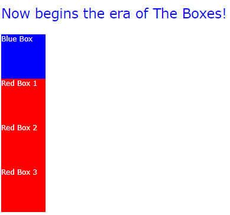

<div class="sdcs-header" markdown>
  
</div>


# CSS Cheat Sheet

## Cascading Style Sheets
CSS staat voor Cascading Style Sheets. Je kan er dus mee stylen. En het woord Cascading betekent trapsgewijs, de bestanden kunnen dus gestapeld worden, daarover hieronder meer.

De eerste versie van CSS werd in 1996 gelanceerd. Inmiddels hebben we versie 3 van CSS.

Browsers hebben zelf ook een ingebouwde stylesheet die de standaard style van elementen bepaalt. Met je eigen stylesheet kan je die standaard styles overschrijven.

## Bronnen
De volgende sites geven uitgebreide informatie over CSS:

|Site|Beschrijving|
|---|---|
|<a href="https://www.w3schools.com/css/default.asp">w3schools CSS Tutorial</a>|Veel voorbeelden en een mooie tryit editor om code uit te proberen.|
|<a href="https://www.codecademy.com/resources/docs/css">Codecademy</a>|Alles over CSS ingedeeld in categoriën. Handige en complete lijsten met kleuren, properties, etc.|
|<a href="css-tricks.com">CSS-TRICS</a>|Mooie tutorials, videos en guides|
|<a href="https://developer.mozilla.org/en-US/docs/Web/CSS">Mozilla Developer Network</a>|De autoriteit voor web development. Zakelijk, maar je weet zeker dat je goed zit|
|<a href="https://templated.live/">TEMPLATED</a>|Een verzameling van html/css templates om inspiratie op te doen|

Als je voorbeeld code uit deze cheat sheet snel wilt uitproberen gebruik dan de <a href="https://www.w3schools.com/css/tryit.asp?filename=trycss_default">TryIt editor van W3Schools</a>.


## inline styles vs externe stylesheets
CSS styles kunnen **inline** gebruikt worden of als externe stylesheets

Als je CSS inline gebruikt dan zet je ze in een <style\> element in de <head/>

```
<head>
  <style>
    #my-style {
      color: yellow;
    }
  </style>
</head>
```
Als je een extern stylesheet gebruikt dan link je het bestand in de <head\>

```
<head>
  <link rel="stylesheet" href="style.css">
</head>

```
Beide methoden zijn goed. Je maakt zelf een keuze welke je wilt gebruiken. Die keuze is afhankelijk van de situatie. 

Als je snel even wat wilt testen, of als je aan het prototypen bent, is een inline style handig.

Voor grotere projecten met uitgebreide styling is het overzichtelijker om externe stylesheets te gebruiken.

## Selectors
Een stylesheet is een tekstbestand met daarin selectors. De selectors bepalen voor welke elementen de style moet gelden.

Een voorbeeld:

In je html heb je het volgende element: 

```
<div id="green-box"/> 
```

In je CSS bestand kan je nu de selector #green-box gebruiken om styling op deze <div/> toe te passen. Bijvoorbeeld zo:
```
#green-box {
  background-color: green;
}
```
Er bestaan verschillende soorten selectors:

|Selector|Soort|voorbeeld|Resultaat|
|---|---|---|---|
|#|id selector|#blue-box {<br>&nbsp;&nbsp;background-color: blue;<br>}|het element met id "blue-box"<br>wordt gestyled|
|.|class selector|.red-box {<br>&nbsp;&nbsp;background-color: red;<br>}|alle elementen met class "red-box"<br>worden gestyled|
|element naam|element selector|p {<br>&nbsp;&nbsp;color: blue;<br>}|alle <p\> elementen<br>worden gestyled|

## Voorbeeld met selectors

``` py title="index.html" 
--8<-- "assets/examples/css/example1/index.html"
```
``` py title="style.css"
--8<-- "assets/examples/css/example1/style.css"
```
Dit geeft het volgende in de Browser:



## Cascading (trapsgewijs)

Je kan meerdere CSS stylesheets tegelijkertijd gebruiken in je HTML. Elk CSS bestand wordt door de Browser ingeladen in de volgorde waarin het bestand in de <head\> voorkomt.

De styles worden daarna gestapeld, dat wil zeggen dat als een style met dezelfde naam voorkomt dat dan de styling wordt uitgebreid met die style. 

Het wordt duidelijker met een voorbeeld:

``` py title="style1.css"
#blue-box {
  background-color: blue;
}

```
``` py title="style2.css"
#blue-box {
  height: 100px;
  width: 100px;
}
```
``` py title="style3.css"
#blue-box {
  height: 150px;
  width: 150px;
  border: 2px solid black;
}
```
Als je deze styles in volgorde toevoegt aan je HTML wordt het resultaat:

```
#blue-box {
  background-color: blue;
  height: 150px;
  width: 150px;
  border: 2px solid black;
}
```

De style #blue-box in style2.css voegt height en width toe aan de style in style1.css

De style #blue-box in style3.css overschrijft de height en width uit style2.css met een andere waarde en voegt een border toe.

## specificity
Het stapelen (cascading) van styles in CSS volgt de regels van **specificity**. Deze regels bepalen welke styles voorrang krijgen:

* **!important** styles hebben de hoogste specificity en krijgen altijd voorrang

* daarna krijgen de **inline** styles met dezelfde specificity voorrang

* daarna krijgen de **id** selectors (#) de voorrang

* daarna krijgen de **class** selectors (.) voorrang

* de **element** styles hebben de laagste specificity

## !important
Als je **!important** achter een style zet dan overschrijft die style alle andere styles, ongeacht de volgorde:

```
#blue-box {
  height: 100px !important;
  width: 100px !important;
}
```
De height en width zullen nu altijd 100px zijn, ongeacht wat andere styles definiëren.

## inheritance
Sommige style properties werken door naar van parent- naar child elements. Een parent is bijvoorbeeld een <div\> element, en een child is de tekst in die <div\>

```html
<style>
  .song-title {font-size: 30px;}
</style>

<div class="song-title"> <!-- parent element -->
  Que Sera, Sera <!-- child element -->
</div>
```
Nu werkt de style property **font-size** van de parent door op de child.

Niet alle properties worden automatisch overgeërfd van de parent. In <a href="https://www.codecademy.com/resources/docs/css/inheritance">deze lijst</a> zie je welke properties wel en welke niet worden overgeërfd.

Als een property niet automatisch wordt overgeërfd van de parent kan je dit toch forceren met de **inherit** value:

```html
<style>
  .song-title {font-size: 30px; padding: 20px;}
  .song-title-text {padding: inherit}
</style>

<div class="song-title">
  <div class="song-title-text">
    Que Sera, Sera
  </div>
</div>
```
De padding property van .song-title zal niet automatisch geërfd worden door de .song-title-text child. Maar we forceren de inheritance zodat de child automatisch de padding van de parent gebruikt.