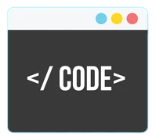

  

# Editors Cheat Sheet

## Het gereedschap van de programmeur
Het gereedschap van de programmeur is de Editor. Editors zijn er in allerlei soorten en maten. Een uitgebreide editor noem je een IDE, een Integrated Development Environment. Een IDE is meer dan een editor, je kan er vaak ook mee runnen en debuggen.

Hier is een lijst met populaire IDE's voor Windows en Mac

Editor|Beschrijving|
|---|---|
|<a href="https://code.visualstudio.com/download">Visual Studio Code</a>|Gratis IDE van Microsoft. Geschikt voor meerdere talen.|
|<a href="https://www.jetbrains.com/idea/download/?section=windows">Intellij</a>|IDE van JetBrains. Gratis voor studenten. Geschikt voor meerdere talen. Er zijn meerdere speciale IDE's van JetBrains beschikbaar voor bijvoorbeeld PHP, HTML/CSS/JavaScript, Android, etc. Vraag je gratis licentie aan via: <a href="https://www.jetbrains.com/shop/eform/students">JetBrains Student License</a>|
|<a href="https://visualstudio.microsoft.com/free-developer-offers/">Visual Studio</a>|De grote broer van Visual Studio Code. Geschikt voor .NET development. Gratis Community Edition.|

## Veelgebruikte functies in veelgebruikte editors

De gevorderde programmeur gebruikt keyboard shortcuts om te programmeren. Hier is een lijst met veelgebruikte shortcuts

<table>
  <tr>
   <td><strong>Functie</strong>
   </td>
   <td><strong>IntelliJ</strong>
   </td>
   <td><strong>Visual Studio</strong>
   </td>
   <td><strong>vscode</strong>
   </td>
   <td><strong>Sublime</strong>
   </td>
   <td><strong>Xcode (Mac)</strong>
   </td>
   <td><strong>Vim</strong>
   </td>
  </tr>
  <tr>
   <td>Duplicate line
   </td>
   <td>Ctrl-D
   </td>
   <td>Ctrl+C;Ctrl+V
   </td>
   <td>Ctrl+C;Ctrl+V

Shift+Alt + Arrow keys
   </td>
   <td>Ctrl+Shift+D
   </td>
   <td>
   </td>
   <td>yyp
   </td>
  </tr>
  <tr>
   <td>Delete line
   </td>
   <td>Ctrl+Y
   </td>
   <td>Shift+Del, Ctrl+X
   </td>
   <td>Shift+Del, Ctrl+X
   </td>
   <td>Ctrl+X
   </td>
   <td>cmd+delete
   </td>
   <td>dd
   </td>
  </tr>
  <tr>
   <td>Move line up/down
   </td>
   <td>Shift+Alt+Up/Down
   </td>
   <td>Alt+Up/Down
   </td>
   <td>Alt+Up/Down
   </td>
   <td>Ctrl+Shift+Up/Down
   </td>
   <td>cmd+opt+[/]
   </td>
   <td>ddp

ddkP
   </td>
  </tr>
  <tr>
   <td>Select line
   </td>
   <td>
   </td>
   <td>
   </td>
   <td>
   </td>
   <td>Ctrl+L
   </td>
   <td>cmd+shift+->
   </td>
   <td>shift + v
   </td>
  </tr>
  <tr>
   <td>Intention Action
   </td>
   <td>Alt+Enter
   </td>
   <td>Ctrl+.
   </td>
   <td>Ctrl+.
   </td>
   <td>
   </td>
   <td>
   </td>
   <td>
   </td>
  </tr>
  <tr>
   <td>Show usage
   </td>
   <td>Ctrl + mouse hover
   </td>
   <td>Shift+F12
   </td>
   <td>
   </td>
   <td>
   </td>
   <td>option+LClick
   </td>
   <td>
   </td>
  </tr>
  <tr>
   <td>Go to declaration
   </td>
   <td>
   </td>
   <td>F12
   </td>
   <td>F12
   </td>
   <td>
   </td>
   <td>
   </td>
   <td>
   </td>
  </tr>
  <tr>
   <td>Rename
   </td>
   <td>Shift+F6
   </td>
   <td>Ctrl+R;Ctrl+R
   </td>
   <td>
   </td>
   <td>
   </td>
   <td>
   </td>
   <td>
   </td>
  </tr>
  <tr>
   <td>Fontsize groter/kleiner
   </td>
   <td>Ctrl+Mousewheel
   </td>
   <td>Ctrl+Shift+.

Ctrl+Shift+,

Ctrl+Mousewheel
   </td>
   <td>Ctrl+Shift+.

Ctrl+Shift+,

Ctrl+Mousewheel (settings: Mouse Wheel Zoom)
   </td>
   <td>Ctrl+= en Ctrl+-

Ctrl + Mouse Scroll
   </td>
   <td>CMD+ +/-
   </td>
   <td>
   </td>
  </tr>
  <tr>
   <td>Make project
   </td>
   <td>Ctrl+F9
   </td>
   <td>Ctrl+Shift+B
   </td>
   <td>
   </td>
   <td>
   </td>
   <td>cmd+shift+B
   </td>
   <td>
   </td>
  </tr>
  <tr>
   <td>Run
   </td>
   <td>Shift+F10
   </td>
   <td>F5
   </td>
   <td>F5
   </td>
   <td>
   </td>
   <td>cmd+r
   </td>
   <td>
   </td>
  </tr>
  <tr>
   <td>Debug
   </td>
   <td>Shift+F9
   </td>
   <td>F5
   </td>
   <td>F5
   </td>
   <td>
   </td>
   <td>
   </td>
   <td>
   </td>
  </tr>
  <tr>
   <td>Step over
   </td>
   <td>F8
   </td>
   <td>F10
   </td>
   <td>F10
   </td>
   <td>
   </td>
   <td>F6
   </td>
   <td>
   </td>
  </tr>
  <tr>
   <td>Step into
   </td>
   <td>F7
   </td>
   <td>F11
   </td>
   <td>F11
   </td>
   <td>
   </td>
   <td>F7
   </td>
   <td>
   </td>
  </tr>
  <tr>
   <td>Step out
   </td>
   <td>Shift+F8
   </td>
   <td>Shift+F11
   </td>
   <td>Shift+F11
   </td>
   <td>
   </td>
   <td>F8
   </td>
   <td>
   </td>
  </tr>
  <tr>
   <td>Continue
   </td>
   <td>F9
   </td>
   <td>F5
   </td>
   <td>F5
   </td>
   <td>
   </td>
   <td>opt+cmd+Y
   </td>
   <td>
   </td>
  </tr>
  <tr>
   <td>Format Code
   </td>
   <td>Ctrl+Alt+L
   </td>
   <td>Ctrl+K, Ctrl+D
   </td>
   <td>Shift+Alt+F
   </td>
   <td>
   </td>
   <td>
   </td>
   <td>
   </td>
  </tr>
  <tr>
   <td>Surround with
   </td>
   <td>Ctrl+Alt+T
   </td>
   <td>Ctrl+K;Ctrl+S
   </td>
   <td>
   </td>
   <td>
   </td>
   <td>
   </td>
   <td>
   </td>
  </tr>
  <tr>
   <td>Line comment //
   </td>
   <td>Ctrl+/
   </td>
   <td>Ctrl+K, Ctrl+C

Ctrl+K, Ctrl+U
   </td>
   <td>Ctrl+/
   </td>
   <td>Ctrl+/
   </td>
   <td>cmd+/
   </td>
   <td>
   </td>
  </tr>
  <tr>
   <td>Block comment /*  */
   </td>
   <td>Ctrl+Shift+/
   </td>
   <td>Ctrl+Shift+/ 

(met Resharper)
   </td>
   <td>Shift+Alt+A
   </td>
   <td>Ctrl+Shift+/
   </td>
   <td>-
   </td>
   <td>
   </td>
  </tr>
  <tr>
   <td>Column select
   </td>
   <td>Shift+Alt+Ins
   </td>
   <td>
   </td>
   <td>
   </td>
   <td>
   </td>
   <td>
   </td>
   <td>
   </td>
  </tr>
  <tr>
   <td>New line on current line
   </td>
   <td>Shift+Enter
   </td>
   <td>
   </td>
   <td>
   </td>
   <td>
   </td>
   <td>
   </td>
   <td>
   </td>
  </tr>
  <tr>
   <td>Open Settings
   </td>
   <td>
   </td>
   <td>
   </td>
   <td>Ctrl+
   </td>
   <td>
   </td>
   <td>
   </td>
   <td>
   </td>
  </tr>
  <tr>
   <td>Open Terminal
   </td>
   <td>
   </td>
   <td>
   </td>
   <td>Ctrl+`
   </td>
   <td>
   </td>
   <td>
   </td>
   <td>
   </td>
  </tr>
  <tr>
   <td>Open Command Palette
   </td>
   <td>
   </td>
   <td>
   </td>
   <td>Ctrl+Shift+P
   </td>
   <td>
   </td>
   <td>
   </td>
   <td>
   </td>
  </tr>
  <tr>
   <td>Split Window
   </td>
   <td>Alt+H (horizontal)

Alt+V (vertical)
   </td>
   <td>Ctrl+ \ (vertical)
   </td>
   <td>
   </td>
   <td>
   </td>
   <td>
   </td>
   <td>
   </td>
  </tr>
</table>

