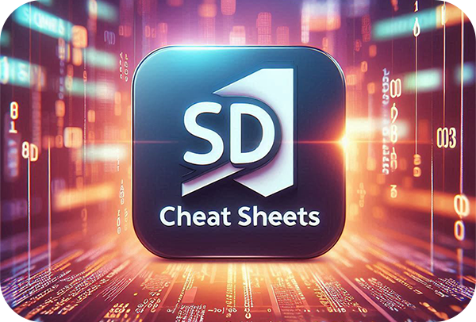

  

# Welkom bij de SD Cheat Sheets

Hier vind je handige Cheat Sheets en Tutorials over Software Development om je geheugen mee op te frissen.

Gebruik de Cheat Sheets om snel even na te lezen hoe je iets ook alweer doet. Vaak krijg je korte code snippets te zien die je direct kunt gebruiken in je eigen code.

De Cheat Sheets zijn in helder Nederlands geschreven en zijn geschikt voor studenten Software Development.