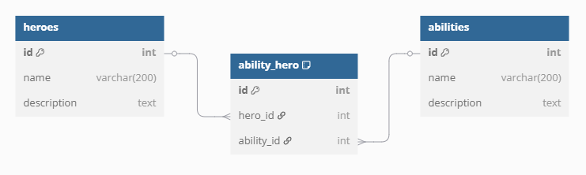

<div class="sdcs-header" markdown>
  
</div>

# Koppeltabellen in Laravel

## Wat gaan we maken
We maken een Laravel applicatie waarmee we **Abilities** aan een Marvel **Hero** kunnen koppelen. 

Dus bijvoorbeeld de hero "Thor" heeft de abilities "Flight" en "Teleportation"

We hebben om te beginnen twee tabellen nodig. De tabel **heroes** en de tabel **abilities**.

Het doel is een applicatie waarmee we een hero kunnen koppelen aan 1 of meer abilities. Dit doe je met een zogenaamde **many-to-many** relatie, ook wel een koppeltabel genoemd. 

Laravel heeft hiervoor een paar handige functies. Je krijgt hieronder stap voor stap te zien hoe je dit met Laravel werkend kunt krijgen.

## Starter project installeren
Bij deze tutorial hoort een starter project. Met dit project krijg je een werkende applicatie om heroes en abilities toe te voegen, te wijzigen en te verwijderen. 

De koppeling tussen een hero en de abilities zit er nog niet in, die ga je zelf toevoegen.

Open een terminal in de directory waar je het project wilt bewaren en clone de repository:

```
git clone --branch starter https://github.com/Dawied/marvelheroes.git
```

Open het project in je favoriete IDE en open een terminal

Voer vervolgens de volgende commando's uit:

```
composer install
```

```
npm install
```

Rename het bestand **example.env** naar **.env** en open het bestand in de editor. Pas de database gegevens aan zodat de applicatie kan inloggen in de database:

```
DB_USERNAME=jouw_username
DB_PASSWORD=jouw_password
```

Genereer een app key:

```
php artisan key:generate
```

Run nu het commando:

```
php artisan migrate
```

Bij de vraag of je de database wilt aanmaken, kies je voor **yes** 

Run nu het commando:

```
php artisan db:seed
```

De database is nu aangemaakt en gevuld met testdata. Je bent klaar om de applicatie uit te testen.

Run het commando:

```
composer run dev
```

En open in je browser http://localhost:8000

Je krijgt de starter applicatie te zien met de testdata. Probeer of je heroes en abilities kan toevoegen, wijzigen en verwijderen. 

Als alles naar behoren werkt kunnen we door naar het bouwen van de koppeling tussen heroes en abilities

## Het datamodel
Het ERD met de koppeltabel ziet er als volgt uit:



De tabellen heroes en abilities zitten al in de starter. 

Je ziet dat er tussen de heroes en de abilities een nieuwe tabel staat. Dit is de koppeltabel. In de koppeltabel zit alleen de primary key van de hero en de primary key van de ability.

!!! note "Naamgeving koppeltabellen"
    De tabel noemen we ability_hero omdat hij de tabellen ability en hero aan elkaar koppelt. De standaard conventie voor een koppeltabel in Laravel is als volgt:

    Gebruik de namen van de gekoppelde tabellen in **enkelvoud** en zet ze achter elkaar in **alfabetische volgorde**, met een underscore ertussen.

    Dus:

    tabel **heroes** in enkelvoud is **hero**, **abilities** in enkelvoud is **ability**, in alfabetische volgorde wordt dit: **ability_hero**. 


## Migration voor de ability_hero tabel
Maak de Laravel migration voor de ability_hero: 

```
php artisan make:migration create_ability_hero
```

Open de nieuwe aangemaakte migration in de editor en voeg de hero_id en ability_id toe als foreignId's:

``` php
public function up(): void
{
    Schema::create('ability_hero', function (Blueprint $table) {
        $table->id();
        $table->foreignId('hero_id');
        $table->foreignId('ability_id');
        $table->timestamps();
    });
}
```

## Model AbilityHero maken

Maak het model AbilityHero:
```
php artisan make:model AbilityHero
```

## BelongsToMany in Hero Model
In het Hero model maken we de relatie voor de many-to-many relatie tussen heroes en abilities. Dit doen we met de Laravel belongsToMany() function.

**Een hero is gekoppeld aan 1 of meer abilities**

Voeg de volgende functie toe:

``` php
public function abilities()
{
  return $this->belongsToMany('abilities');
}
```
## Een View voor de koppeltabel maken
Nu maken we een view waarmee we een lijst met Abilities tonen met checkboxes ernaast. Door de checkboxen aan te vinken kan de gebruiker Abilities koppelen aan de Hero. 

De View wordt geïnclude in de create.blade.php en de edit.blade.php van Hero.

Maak een nieuw bestand in resources/views/heroes en noem het bestand **abilities_checkbox_table.blade.php**

Voeg de onderstaande code toe aan het bestand:

``` php
<label>Abilities</label>
<table class="table">
    <tbody>
    @foreach($abilities as $ability) 
        <tr>
            <td>
                <input
                    aria-label="link"
                    type="checkbox"
                    name="linkedAbilities[]"
                    value="{{ $ability->id }}"
                    {{ $linkedAbilities->contains('ability_id', $ability->id) ? 'checked' : '' }}
                >
            </td>
            <td>{{$ability->name}}</td>
        </tr>
    @endforeach
    </tbody>
</table>
```

## De HeroController aanpassen
Bekijk de code van abilities_checkbox_table.blade.php hierboven. Je ziet dat er twee variabelen gebruikt worden: **$abilities** en **$linkedAbilities**. In $abilities zit een lijst met alle beschikbare abilities. In $linkedAbilities zitten de abilities die al gelinkt zijn met de Hero. 

Deze twee variabelen moeten we vanuit de controller meegeven aan de create View en de edit View.

Pas in de HeroController eerst de functie create() aan. We halen alle abilities op. Voor de lijst met gelinkte abilities gebruiken we een lege Collection omdat we een nieuwe Hero aanmaken en er dus nog geen gelinkte abilities zijn. We geven de variabelen mee aan de view.

``` php hl_lines="3 4"
public function create()
{
  $abilities = Ability::all();
  $linkedAbilities = new Collection();

  return view('heroes.create', compact('abilities', 'linkedAbilities'));
}
```

Pas in de HeroController de functie edit() aan. We halen alle abilities op. Voor de lijst met gelinkte abilities halen we de gelinkte abilities op. We geven de variabelen mee aan de view.

``` php hl_lines="3 4"
public function edit(Hero $hero)
{
    $abilities = Ability::all();
    $linkedAbilities = AbilityHero::where('hero_id', $hero->id)->get();

    return view('heroes.edit', compact('hero', 'abilities', 'linkedAbilities'));
}
```

## De koppeltabel View includen in de create en edit View van heroes

Nu includen we de nieuwe View in de create en edit views van heroes:

``` php hl_lines="8 9"
<form action="{{ route('heroes.store') }}" method="POST">
    @csrf
    <div class="form-group">
        <label for="name">Name</label>
        <input type="text" name="name" class="form-control" required>
    </div>

    <!-- include de tabel met te linken abilities -->
    @include('heroes.abilities_checkbox_table')

    <button type="submit" class="btn btn-primary mt-4">Save</button>
</form>
```

``` php hl_lines="9 10"
<form action="{{ route('heroes.update', $hero->id) }}" method="POST">
    @csrf
    @method('PUT')
    <div class="form-group">
        <label for="name">Name</label>
        <input type="text" name="name" class="form-control" value="{{ $hero->name }}" required>
    </div>

    <!-- include de tabel met te linken abilities -->
    @include('heroes.abilities_checkbox_table')

    <button type="submit" class="btn btn-primary mt-4">Save</button>
</form>
```

## De store en update functies aanpassen om de gelinkte abilities op te slaan
Dit is de allerlaatste stap. In de code van abilities_checkbox_table.blade.php kan je zien dat de aangevinkte checkboxen worden verzameld in de array **linkedAbilities**. Die array is dus terug te vinden in de request van de edit en create forms.

Met die informatie kunnen we in de store en de update van de HeroController onze koppeltabel vullen met nieuwe Hero-Ability relaties, of juist de bestaande relaties updaten.

Hiervoor bestaan twee handige functies in Laravel: **attach()** om nieuwe relaties toe te voegen en **sync()** om oude relaties te verwijderen en nieuwe toe te voegen. 

Sync en Attach werken met een array van id's, in ons geval dus de linkedAbilities array van onze checkboxen. 

Pas de store() in de HeroController aan en voeg een attach() toe:

``` php hl_lines="9"
public function store(Request $request)
{
    $request->validate([
        'name' => 'required',
    ]);

    $hero = Hero::create($request->all());

    $hero->abilities()->attach($request->get('linkedAbilities'));

    return redirect()->route('heroes.index')->with('success', 'Hero created');
}
```

pas ook de update() in de HeroController aan en voeg een sync() toe:

``` php hl_lines="9"
public function update(Request $request, Hero $hero)
{
    $request->validate([
        'name' => 'required',
    ]);

    $hero->update($request->all());

    $hero->abilities()->sync($request->get('linkedAbilities'));

    return redirect()->route('heroes.index')
        ->with('success', 'Hero updated');
}
```

## Testen
Je bent klaar! Met een minimum aan code heb je op een eenvoudige manier een koppeling mogelijk gemaakt tussen Heroes en Abilities. De gebruiker vinkt de gewenste abilities aan in het formulier en de koppeltabel wordt netjes bijgewerkt.

Uiteraard kan je deze techniek voor een willekeurige andere many-to-many relatie gebruiken.

Test de applicatie door een nieuwe Hero met Abilities toe te voegen en te wijzigen. Kijk ook in de koppeltabel om de nieuwe relaties te bekijken.

## TODO
Er blijft een belangrijk puntje open in deze tutorial. 

Als een Hero gelinkt is aan een Ability, en je verwijderd die Ability dan blijft de link bestaan. Je zal de link niet meer zien in de applicatie, maar in de tabel ability_hero kan je de link nog wel terugvinden. Dat is niet netjes.

En als je een Hero verwijderd die links had met Abilities dan blijven die links ook bestaan in de database.

Per applicatie moet je zelf bepalen wat gewenst is. In het geval van onze Heroes en Ability is het volgende logisch:

Als de gebruiker een Ability probeert te verwijderen die nog gelinkt is aan een Hero dan staan we dat niet toe. De gebruiker krijgt een foutmelding die uitlegt dat de Ability nog niet verwijderd kan worden omdat die nog gebruikt wordt. Dit doen we met een **restrict delete** in de database.

Als de gebruiker een Hero verwijderd dan verwijderen we ook de links met Abilities voor die Hero. Dit doen we met een **cascade delete**.

Pas de migration van de ability_hero tabel aan:

``` hl_lines="5 6"
public function up(): void
{
    Schema::create('ability_hero', function (Blueprint $table) {
        $table->id();
        $table->foreignId('hero_id')->constrained()->onDelete('cascade');;
        $table->foreignId('ability_id')->constrained()->onDelete('restrict');
        $table->timestamps();
    });
}
```

Ververs de migrations:

```
php artisan migrate:fresh
```

En seed de (nu lege) database opnieuw met onze testdata:

```
php artisan db:seed
```

Nu gaan we goed testen:

### Test 1 - restrict delete ability

1. Koppel een Ability aan een Hero
2. Check in de tabel ability_hero dat de link is aangemaakt
3. Probeer de Ability te verwijderen, als het goed is krijg je een Laravel foutmelding
4. Check dat de link nog steeds aanwezig is in de tabel

De restrict delete werkt, de Ability kan niet verwijderd worden als die gebruikt wordt in een link met een Hero. De foutmelding is niet netjes, maar dat lossen we straks op.

### Test 2 - cascade delete hero

1. Koppel een Ability aan een Hero
2. Check in de tabel ability_hero dat de link is aangemaakt
3. Verwijder de Hero, er hoort geen foutmelding te komen
4. Check in de tabel ability_hero dat de link is verwijder

De cascade delete werkt. Als een Hero wordt verwijderd dan worden automatisch de gelinkte abilities uit de koppeltabel verwijderd.

### Nette melding voor de gebruiker

Blijft over de lelijke foutmelding als we een gelinkte Ability proberen te verwijderen. Die gaan we vervangen met een nette melding voor de gebruiker.

Je moet in de destroy() functie in de AbilityController zijn. Hier zouden we de $ability->delete() in een try-catch kunnen zetten en een foutmelding geven als de catch afgaat. Maar, je kan ook eerst controleren of er nog gebruikt wordt gemaakt van de Ability. Die laatste optie kiezen we hier, 'voorkomen is beter dan genezen'.

Controleer eerst of de ability nog gebruikt worden, zoja, geef een melding aan de gebruiker:

``` php hl_lines="3-6"
public function destroy(Ability $ability)
{
    $exists = AbilityHero::where('ability_id', $ability->id)->exists();
    if ($exists) {
        return redirect()->route('abilities.index')->with('error', 'Cannot delete this Ability because it is still being used');
    }

    $ability->delete();

    return redirect()->route('abilities.index')
        ->with('success', 'Ability deleted');
}
```

En in de index.blade.php van abilities voeg je code toe om de melding te laten zien:

``` php
@if(session('error'))
    <div class="alert alert-danger">
        {{ session('error') }}
    </div>
@endif

@if(session('success'))
    <div class="alert alert-success">
        {{ session('success') }}
    </div>
@endif
```    

## DONE
Het zit erop. Hopelijk kan je dit voorbeeld goed gebruiken om in je eigen applicaties koppeltabellen te gebruiken. 

**Bedankt voor je aandacht en happy coding!**